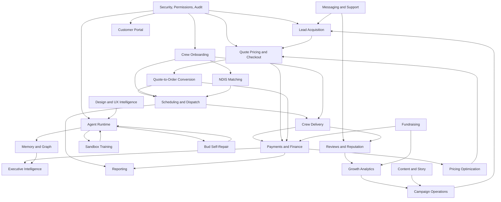
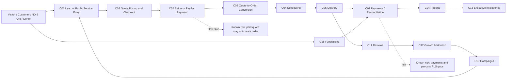
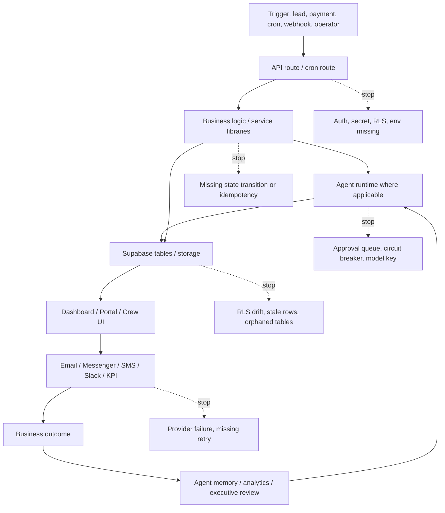

# Bud OS Business Capability Atlas
Date: 2026-07-08  
Status: First permanent architectural reference  
Mode: Verification only; no code changes

## Source Of Truth

This atlas is based on the completed Business Capability Audit recorded in `Buds At Work/Dev/Dev Log 2026-07-08.md`, especially the production inventory, dependency map, and synthesis addenda. It is cross-checked against the current repository surfaces:

- Dashboard and portal pages under `src/app`
- API routes under `src/app/api`
- Agent registry and workflows under `src/lib/agents`
- Cron configuration in `vercel.json`
- Supabase migrations under `supabase/migrations`
- Environment references in `src`

Known audit findings that control this atlas:

- 65 agent files were confirmed.
- Agent-to-agent coupling is not direct; coupling happens through Supabase tables, actions, tasks, memory, and dashboards.
- Mission Control queries roughly 20 database views/tables in parallel.
- `AgentHierarchy.tsx` contains 20 hardcoded agent IDs and requires manual upkeep.
- 73 tables and 156 migrations were reported by the audit.
- 15+ tables have no RLS, including critical finance tables `payments` and `payouts`.
- `vercel-repair` is confirmed orphaned.
- Quote-to-order conversion is not guaranteed after Stripe checkout.
- `quote-triage` can auto-send low-value, high-confidence quote responses without approval.
- Upstash Redis exists, but quote reminder throttling still uses in-memory rate limiting.

## 1. Executive Summary

Bud OS maps into 24 production business capabilities. The highest-priority work is not grouped by department; it follows dependency depth. The deepest chain starts with intake, identity, pricing, quote conversion, orders, scheduling, crew execution, payments, and observability. Breaks in those layers block downstream dashboards, automation, executive intelligence, growth attribution, and learning.

The strongest systems are the agent runtime, content/story operations, and dashboard coverage. The weakest systems are quote-to-order continuity, payment reconciliation controls, NDIS matching closure, security/RLS consistency, and orphaned automation execution chains. The highest business risk is that money-facing capabilities have more execution than observability: payments, payouts, checkout, quote conversion, reminders, and finance intelligence do not yet share a fully reliable audit, retry, and alert story.

Priority formula:

`Priority = Business Criticality x (5 - Maturity)`

Highest priority capabilities:

| Rank | Capability | Criticality | Maturity | Priority | Why it ranks high |
|---:|---|---:|---:|---:|---|
| 1 | Quote-to-Order Conversion | 10 | 2 | 30 | Paid quotes may not always become operational orders. |
| 2 | Security, Permissions, and Audit | 10 | 2 | 30 | RLS gaps include critical finance tables. |
| 3 | Payments, Reconciliation, and Finance Control | 10 | 3 | 20 | Revenue protection depends on Stripe, webhook, payment, payout, and reconciliation integrity. |
| 4 | Lead Acquisition and Triage | 9 | 3 | 18 | Top of funnel feeds all revenue workflows; auto-send logic increases risk. |
| 5 | NDIS Provider and Participant Matching | 9 | 3 | 18 | Compliance and revenue risk if matching or subscription flows fail. |
| 6 | Job Scheduling and Dispatch | 9 | 3 | 18 | Paid work can stall before delivery. |
| 7 | Customer Messaging and Support | 8 | 3 | 16 | Human response bottlenecks and Messenger/email dependencies affect conversion. |
| 8 | Crew Recruitment and Onboarding | 8 | 3 | 16 | Delivery capacity depends on this. |
| 9 | Agent Runtime and Mission Control | 8 | 3 | 16 | Shared automation layer; hardcoded agent hierarchy and action queues are systemic risks. |
| 10 | Sandbox Training and Agent QA | 7 | 3 | 14 | Prevents regressions in autonomous work but has complex table dependencies. |

## 2. Capability Atlas

Scoring: Criticality is 1-10. Maturity is 1-5. Executive scores are 1-10 for BV = Business Value, TR = Technical Risk, OR = Operational Risk, AL = Automation Level, OBS = Observability, MAINT = Maintainability.

### Capability Index Sorted By Priority

| Priority | ID | Capability | Owner | Criticality | Maturity | Revenue class | Failure impact |
|---:|---|---|---|---:|---:|---|---|
| 30 | C03 | Quote-to-Order Conversion | COO / CFO | 10 | 2 | Revenue protecting | Paid revenue may not become scheduled work; customer trust and cash reconciliation fail. |
| 30 | C21 | Security, Permissions, and Audit | Platform / COO | 10 | 2 | Compliance | Sensitive operational and finance data exposure; audit defensibility weakens. |
| 20 | C07 | Payments, Reconciliation, and Finance Control | CFO | 10 | 3 | Revenue protecting | Revenue leakage, payout mismatch, disputes, incorrect executive metrics. |
| 18 | C01 | Lead Acquisition and Triage | CMO / Sales | 9 | 3 | Revenue generating | Inbound demand is missed or mishandled; quote volume drops. |
| 18 | C08 | NDIS Provider and Participant Matching | NDIS / Operations | 9 | 3 | Revenue generating / Compliance | NDIS jobs cannot be safely matched, published, or billed. |
| 18 | C04 | Job Scheduling and Dispatch | Operations | 9 | 3 | Revenue protecting | Confirmed work stalls, reminders fail, crews arrive unprepared. |
| 16 | C10 | Customer Messaging and Support | Operations / CMO | 8 | 3 | Revenue protecting | Customers wait, leads cool, service issues become manual. |
| 16 | C09 | Crew Recruitment and Onboarding | Operations / HR | 8 | 3 | Operational | Capacity growth stalls; document/payroll/compliance readiness unclear. |
| 16 | C17 | Agent Runtime and Mission Control | Platform | 8 | 3 | Platform | Automation and approvals lose coordination. |
| 14 | C18 | Sandbox Training and Agent QA | Platform | 7 | 3 | Platform | Agent changes become harder to validate safely. |
| 14 | C23 | Pricing Optimization | CFO / Operations | 7 | 3 | Revenue generating | Margin and conversion drift without a reliable pricing feedback loop. |
| 12 | C02 | Quote Pricing and Checkout | Sales / CFO | 10 | 4 | Revenue generating | Customers cannot pay; revenue collection stops at quote. |
| 12 | C05 | Crew Delivery and Field Execution | Operations | 8 | 4 | Revenue protecting | Work quality, proof, completion, and crew comms degrade. |
| 12 | C11 | Reviews and Reputation | CMO / Operations | 6 | 3 | Revenue protecting | Social proof and service recovery loops weaken. |
| 12 | C19 | Bud Self-Repair and DevOps Automation | Platform | 6 | 3 | Platform | Build failure response and repair learning degrade; orphaned repair cron remains risk. |
| 12 | C22 | Design System and UX Intelligence | Platform / Product | 6 | 3 | Supporting | UI quality signals fragment; design regressions persist longer. |
| 10 | C16 | Executive Intelligence | CEO | 5 | 3 | Internal intelligence | Strategic agents act on incomplete or stale metrics. |
| 10 | C20 | Memory and Knowledge Graph | Platform | 5 | 3 | Internal intelligence | Learning, search, and agent context become stale or inconsistent. |
| 10 | C24 | Reporting and Insights | CEO / COO | 5 | 3 | Internal intelligence | Operators lose visibility into performance and bottlenecks. |
| 8 | C06 | Customer Portal and Subscriptions | Operations / CFO | 8 | 4 | Revenue protecting | Customers cannot self-serve orders, payments, schedule, profile, or subscriptions. |
| 8 | C12 | Growth Analytics and Attribution | CMO | 4 | 3 | Internal intelligence | Marketing spend and funnel decisions lose measurement. |
| 8 | C13 | Marketing Campaign Operations | CMO | 4 | 3 | Revenue generating | Campaign planning and publishing coordination slow down. |
| 8 | C14 | Content and Story Intelligence | CMO / Creative | 4 | 3 | Supporting | Content learning loop loses continuity. |
| 6 | C15 | Fundraising and Donations | CEO / Partnerships | 6 | 4 | Revenue generating | Fundraising contributions and public impact data fail. |

### C01 - Lead Acquisition and Triage

| Field | Value |
|---|---|
| Purpose | Capture inbound leads from public contact, Messenger, phone, and service flows, then score and triage them into quotes or replies. |
| Owner | CMO / Sales |
| Criticality / Maturity / Priority | 9 / 3 / 18 |
| UI pages | `/contact`, `/services`, `/dashboard/leads`, `/dashboard/leads/[id]`, Mission Control open enquiries panel |
| API routes | `/api/leads/contact`, `/api/leads/messenger`, `/api/leads/phone`, `/api/leads`, `/api/leads/[id]`, `/api/leads/[id]/status`, `/api/webhooks/messenger` |
| Agents | `phone-transcriber`, `customer-reply`, `quote-triage`, `lead-scorer`, `lapsed-win-back` |
| Cron / workers | `/api/agents/cron?agent_id=quote-triage` every 15 min; `customer-reply` every 30 min; `lead-scorer` hourly; `lapsed-win-back` weekly |
| Tables | `leads`, `conversations`, `messages`, `phone_calls`, `agent_runs`, `agent_actions`, `quote_funnel_events` |
| Buckets | None confirmed |
| External integrations | Messenger Graph API, Resend, Twilio, OpenAI Whisper, Anthropic/Gemini agent runtime |
| Env vars | `MESSENGER_APP_SECRET`, `MESSENGER_PAGE_ACCESS_TOKEN`, `MESSENGER_VERIFY_TOKEN`, `MESSENGER_INGEST_SECRET`, `TWILIO_*`, `OPENAI_API_KEY`, `RESEND_API_KEY`, `ANTHROPIC_API_KEY`, `GEMINI_API_KEY`, Supabase vars |
| Feature flags | `BUD_AUTONOMY_LEVEL`, `BUD_OS_EXECUTION_ENABLED` affect agent execution; Turnstile can gate forms |
| Flow | Customer enquiry -> lead/messenger/phone API -> lead normalization and source classification -> lead/customer agents -> `leads`, `conversations`, `messages`, `agent_actions` -> leads dashboard and Mission Control -> email/Messenger/operator follow-up -> quote or closed lead -> funnel event and agent memory. |
| Flow stops | Missing Messenger secrets; missing Resend/Twilio/OpenAI keys; lead not converted to quote; quote-triage approval queue not acted on; auto-send path can bypass human review for low-value confident quotes. |
| Dependencies | Upstream: public site, auth/session where applicable, Messenger/Twilio. Downstream: quote pricing, customer messaging, growth attribution, executive metrics. Shared: Supabase, agent runtime, audit/action queues. Blocking: C02, C10, C17. Dependents: C02, C12, C16. |
| Operational health | Single points: Messenger webhook, Supabase writes, agent cron. Missing monitoring: lead ingestion SLA and auto-send outcomes. Missing alerts: failed webhook verification, stale untriaged leads. Missing retries: outbound replies. Missing audit logs: auto-send decisions need consistent quote audit. Manual bottlenecks: lead-to-quote handoff. Dead/orphan risk: none confirmed, but lead surfaces depend on status discipline. |
| Executive score | BV 9, TR 7, OR 8, AL 7, OBS 5, MAINT 6 |

### C02 - Quote Pricing and Checkout

| Field | Value |
|---|---|
| Purpose | Generate service estimates, calculate prices, capture quote records, and collect payment through Stripe/PayPal. |
| Owner | Sales / CFO |
| Criticality / Maturity / Priority | 10 / 4 / 12 |
| UI pages | `/services`, `/services/[slug]`, `/services/checkout/success`, `/services/checkout/cancel`, `/pay/[quoteId]`, `/dashboard/quotes`, `/dashboard/quotes/[id]`, `/dashboard/analytics/quote-funnel` |
| API routes | `/api/quotes`, `/api/quotes/[id]`, `/api/quotes/[id]/checkout`, `/api/quotes/[id]/remind`, `/api/pay/[quoteId]`, `/api/checkout`, `/api/paypal/create-order`, `/api/paypal/capture-order/[orderId]`, `/api/rego-lookup`, `/api/geo/mmm`, `/api/analytics/quote-funnel` |
| Agents | `quote-triage`, `price-optimizer`, `yard-map-geo`, `conversion-funnel` |
| Cron / workers | `price-optimizer` weekly; `remind-quotes` daily; `reengage-quotes` daily |
| Tables | `quotes`, `quote_funnel_events`, `service_pricing`, `pricing_recommendations`, `orders`, `payments` |
| Buckets | None confirmed |
| External integrations | Stripe, PayPal, Google Maps, Rego lookup provider, PostHog/analytics providers |
| Env vars | `STRIPE_SECRET_KEY`, `STRIPE_WEBHOOK_SECRET`, `PAYPAL_*`, `NEXT_PUBLIC_PAYPAL_*`, `NEXT_PUBLIC_GOOGLE_MAPS_API_KEY`, `REGO_LOOKUP_PROVIDER_*`, `REGCHECK_*`, `NEXT_PUBLIC_SITE_URL`, Supabase vars |
| Feature flags | Turnstile gating; `BUD_OS_EXECUTION_ENABLED` for agent recommendations |
| Flow | Service request -> quote API/pricing engine -> quote-triage or pricing logic -> optional agent estimate -> `quotes` and funnel events -> quote dashboard/payment page -> Stripe/PayPal checkout notification -> paid quote outcome -> pricing/funnel learning. |
| Flow stops | Pricing provider/key missing; Stripe checkout succeeds but C03 may not create order; in-memory quote reminder throttle does not survive cold starts; PayPal/Stripe divergence; abandoned quote not reengaged. |
| Dependencies | Upstream: C01, public service catalog, pricing constants. Downstream: C03, C07, C12, C23. Shared: Supabase, Stripe, PayPal, analytics. Blocking: C03. Dependents: C04, C06, C07, C16. |
| Operational health | Single points: Stripe secret/webhook and quote route. Missing monitoring: checkout-to-webhook-to-order completion. Missing alerts: webhook failure and unpaid reminder failure. Missing retries: reminder email/send. Missing audit logs: checkout state transitions should be complete. Manual bottlenecks: quote approval queue for higher value quotes. Orphaned APIs: none confirmed. |
| Executive score | BV 10, TR 6, OR 7, AL 7, OBS 6, MAINT 7 |

### C03 - Quote-to-Order Conversion

| Field | Value |
|---|---|
| Purpose | Convert accepted/paid quotes into operational orders that can be scheduled, assigned, delivered, reminded, and reported. |
| Owner | COO / CFO |
| Criticality / Maturity / Priority | 10 / 2 / 30 |
| UI pages | `/dashboard/orders`, `/dashboard/jobs`, `/portal/orders`, `/portal/schedule`, `/services/checkout/success` |
| API routes | `/api/webhooks/stripe`, `/api/orders`, `/api/orders/[id]`, `/api/orders/by-session`, `/api/orders/[id]/assign`, `/api/crew/jobs` |
| Agents | `scheduling`, `crew-briefing`, `reconciliation`, `coo-agent` |
| Cron / workers | Stripe webhook; `auto-complete-jobs`; `scheduling` daily |
| Tables | `quotes`, `orders`, `payments`, `subscriptions`, `agent_actions`, `audit_log` |
| Buckets | None confirmed |
| External integrations | Stripe checkout/webhooks, PayPal capture path |
| Env vars | `STRIPE_SECRET_KEY`, `STRIPE_WEBHOOK_SECRET`, `NEXT_PUBLIC_SITE_URL`, Supabase vars |
| Feature flags | None confirmed beyond execution flags for agents |
| Flow | Payment success/webhook -> checkout/session lookup -> quote/payment update -> order creation/update -> scheduling agent/business logic -> `orders` -> dashboard/portal -> reminders/crew assignment -> completed job -> payment/revenue learning. |
| Flow stops | Audit explicitly found no guaranteed quote-acceptor loop that monitors paid quotes and creates orders. Webhook failure, missing session metadata, or PayPal path divergence can stop the lifecycle before operations see the job. |
| Dependencies | Upstream: C02, Stripe/PayPal, auth/customer identity. Downstream: C04, C05, C07, C11, C16, C24. Shared: Supabase, webhooks, audit. Blocking: C04 and C07. Dependents: nearly all operations and reporting capabilities. |
| Operational health | Single points: Stripe webhook route and order creation logic. Missing monitoring: paid quote with no order. Missing alerts: webhook/order mismatch. Missing retries: order creation idempotent retry not confirmed. Missing audit logs: conversion gap. Manual bottlenecks: operator reconciliation. Broken chain: confirmed by audit. |
| Executive score | BV 10, TR 9, OR 10, AL 4, OBS 3, MAINT 5 |

### C04 - Job Scheduling and Dispatch

| Field | Value |
|---|---|
| Purpose | Schedule orders, assign crew, send day-before reminders, and keep operations aware of upcoming work. |
| Owner | Operations |
| Criticality / Maturity / Priority | 9 / 3 / 18 |
| UI pages | `/dashboard/schedule`, `/dashboard/jobs`, `/dashboard/orders`, `/crew/schedule`, `/crew/jobs`, `/crew/my-jobs`, `/portal/schedule` |
| API routes | `/api/orders/[id]/assign`, `/api/orders/[id]/remind-day-before`, `/api/crew/jobs`, `/api/crew/jobs/[id]`, `/api/crew/jobs/[id]/complete`, `/api/crew/my-jobs`, `/api/cron/remind-day-before`, `/api/cron/auto-complete-jobs` |
| Agents | `scheduling`, `crew-briefing`, `coo-agent`, `field-producer` |
| Cron / workers | `scheduling` daily; `remind-day-before` daily; `auto-complete-jobs` daily; `field-producer` daily |
| Tables | `orders`, `employees`, `agent_actions`, `agent_runs`, `whs_records` |
| Buckets | None confirmed |
| External integrations | Resend, optionally Twilio/Messenger for notifications |
| Env vars | `RESEND_API_KEY`, `CRON_SECRET`, Supabase vars, optional Twilio/Messenger vars |
| Feature flags | None confirmed |
| Flow | Order ready -> scheduling/assignment API -> business logic updates order/crew -> scheduling and crew-briefing agents -> `orders`/agent tables -> dashboard/crew portal -> reminders -> job prepared -> delivery feedback/learning. |
| Flow stops | No order from C03; unassigned crew; failed reminder email; stale schedule dates; no retry/alert on reminder failure. |
| Dependencies | Upstream: C03, C09. Downstream: C05, C07, C11, C14, C24. Shared: Supabase, agent runtime, email. Blocking: crew availability. Dependents: delivery, reviews, content capture. |
| Operational health | Single points: order table and cron reminder routes. Missing monitoring: unassigned scheduled jobs. Missing alerts: reminder/send failures. Missing retries: reminder delivery. Missing audit logs: dispatch status changes. Manual bottlenecks: crew assignment. |
| Executive score | BV 9, TR 6, OR 8, AL 6, OBS 5, MAINT 6 |

### C05 - Crew Delivery and Field Execution

| Field | Value |
|---|---|
| Purpose | Enable crew to execute jobs, access job details, complete work, upload documents/photos, and receive operational guidance. |
| Owner | Operations |
| Criticality / Maturity / Priority | 8 / 4 / 12 |
| UI pages | `/crew`, `/crew/jobs`, `/crew/jobs/[id]`, `/crew/my-jobs`, `/crew/documents`, `/crew/earnings`, `/crew/support-profile`, `/dashboard/jobs`, `/dashboard/crew` |
| API routes | `/api/crew/jobs`, `/api/crew/jobs/[id]`, `/api/crew/jobs/[id]/complete`, `/api/crew/documents`, `/api/crew/documents/upload`, `/api/crew/earnings`, `/api/crew/support-profile`, `/api/crew/me` |
| Agents | `crew-briefing`, `crew-coach`, `photo-qa`, `whs-safety-reminder`, `field-producer` |
| Cron / workers | `whs-safety-reminder` weekly; `field-producer` daily |
| Tables | `orders`, `employees`, `employee_documents`, `job_photos`, `crew_coach_notes`, `whs_records`, `payouts` |
| Buckets | `crew-documents`; job photo storage path table exists |
| External integrations | Supabase Storage, Resend, optional Twilio |
| Env vars | Supabase vars, `RESEND_API_KEY`, optional Twilio vars |
| Feature flags | None confirmed |
| Flow | Scheduled job -> crew portal/API -> crew briefing and safety agents -> `orders`, documents/photos, WHS records -> crew/admin dashboards -> completion notification -> payment/review/content capture -> coaching and delivery learning. |
| Flow stops | Missing crew access approval; failed document upload; incomplete job status; photo QA not linked to job; payout visibility depends on finance tables. |
| Dependencies | Upstream: C04, C09. Downstream: C07, C11, C14, C24. Shared: Supabase Storage, auth, crew roles. Blocking: C21 for permissions. Dependents: reviews, payroll/earnings, content capture. |
| Operational health | Single points: crew auth and orders. Missing monitoring: stuck active jobs and failed uploads. Missing alerts: incomplete jobs past scheduled date. Missing retries: uploads/notifications. Missing audit logs: crew document and job completion changes. Manual bottlenecks: document review and exception handling. |
| Executive score | BV 8, TR 5, OR 7, AL 5, OBS 5, MAINT 7 |

### C06 - Customer Portal and Subscriptions

| Field | Value |
|---|---|
| Purpose | Let customers view orders, quotes, payments, profile, property, schedule, and subscriptions. |
| Owner | Operations / CFO |
| Criticality / Maturity / Priority | 8 / 4 / 8 |
| UI pages | `/portal`, `/portal/orders`, `/portal/payments`, `/portal/profile`, `/portal/property`, `/portal/quotes`, `/portal/schedule`, `/portal/subscriptions` |
| API routes | `/api/portal/profile`, `/api/portal/property`, `/api/portal/ratings`, `/api/portal/subscriptions/[id]/request-change`, `/api/subscriptions`, `/api/subscriptions/[id]` |
| Agents | `customer-reply`, `lapsed-win-back`, `reviews` |
| Cron / workers | Reengagement and reminder crons indirectly affect portal flows |
| Tables | `customers`, `quotes`, `orders`, `subscriptions`, `payments`, `ratings`/feedback tables |
| Buckets | None confirmed |
| External integrations | Stripe subscriptions/payments, Resend |
| Env vars | `STRIPE_SECRET_KEY`, `ADMIN_NOTIFY_EMAIL`, `NEXT_PUBLIC_SITE_URL`, Supabase vars |
| Feature flags | None confirmed |
| Flow | Authenticated customer -> portal route/API -> business logic reads customer records -> optional support/reply agent -> database -> portal dashboards -> email/admin notification -> self-service outcome -> ratings and support learning. |
| Flow stops | Auth mismatch; missing customer linkage; subscription change is request-based and can stop at admin notification; missing Stripe sync. |
| Dependencies | Upstream: C02, C03, C21. Downstream: C10, C11, C24. Shared: Supabase auth, Stripe, email. Blocking: account identity. Dependents: retention and support. |
| Operational health | Single points: user/customer mapping. Missing monitoring: portal API failures and subscription requests aging. Missing alerts: failed admin notifications. Missing retries: subscription change email. Missing audit logs: profile/property changes. Manual bottlenecks: subscription change approval. |
| Executive score | BV 7, TR 5, OR 5, AL 5, OBS 5, MAINT 7 |

### C07 - Payments, Reconciliation, and Finance Control

| Field | Value |
|---|---|
| Purpose | Record revenue, payments, payouts, disputes, payables, expenses, cash flow forecasts, and reconciliation findings. |
| Owner | CFO |
| Criticality / Maturity / Priority | 10 / 3 / 20 |
| UI pages | `/dashboard/payments`, `/dashboard/invoices`, `/dashboard/expenses`, `/dashboard/subscriptions`, `/dashboard/reports`, `/dashboard/executive`, `/portal/payments`, money dashboard tabs |
| API routes | `/api/webhooks/stripe`, `/api/payables`, `/api/subscriptions`, `/api/subscriptions/[id]`, `/api/dashboard`, `/api/cron/weekly-kpi-email` |
| Agents | `reconciliation`, `cash-flow-forecaster`, `stripe-dispute-manager`, `cfo-agent`, `price-optimizer` |
| Cron / workers | `reconciliation` daily; `cash-flow-forecaster` weekly; weekly KPI email; Stripe webhook |
| Tables | `payments`, `payouts`, `payables`, `expenses`, `subscriptions`, `stripe_disputes`, `cash_flow_forecasts`, `orders`, `quotes`, `executive_metrics_snapshots` |
| Buckets | None confirmed |
| External integrations | Stripe, Resend |
| Env vars | `STRIPE_SECRET_KEY`, `STRIPE_WEBHOOK_SECRET`, `RESEND_API_KEY`, Supabase vars |
| Feature flags | None confirmed |
| Flow | Checkout/webhook/manual finance event -> finance API/business logic -> reconciliation/cash-flow agents -> finance tables -> dashboards/reports/executive layer -> alerts/email where configured -> correction/dispute/action -> pricing and executive learning. |
| Flow stops | Audit flags missing RLS on `payments` and `payouts`; quote-to-order gap; webhook failure; reconciliation actions may remain proposed; no confirmed retries for finance notifications. |
| Dependencies | Upstream: C02, C03, C04. Downstream: C16, C23, C24. Shared: Stripe, Supabase, executive agents. Blocking: C21, C03. Dependents: executive decisions, pricing, reports. |
| Operational health | Single points: Stripe webhook and finance tables. Missing monitoring: payment/order mismatch, payout mismatch, dispute SLA. Missing alerts: failed webhook, reconciliation mismatch. Missing retries: webhook-derived side effects. Missing audit logs: finance mutation trace. Manual bottlenecks: dispute and mismatch review. |
| Executive score | BV 10, TR 8, OR 9, AL 6, OBS 4, MAINT 5 |

### C08 - NDIS Provider and Participant Matching

| Field | Value |
|---|---|
| Purpose | Manage NDIS organisations, participants, requirements, job publishing, and matching against crew/provider constraints. |
| Owner | NDIS / Operations |
| Criticality / Maturity / Priority | 9 / 3 / 18 |
| UI pages | `/dashboard/ndis`, `/dashboard/ndis/match/[orderId]`, `/crew/onboarding/ndis` |
| API routes | `/api/ndis/organisations`, `/api/ndis/organisations/[id]`, `/api/ndis/organisations/[id]/participants`, `/api/ndis/organisations/[id]/subscribe`, `/api/ndis/participants`, `/api/ndis/jobs/pending-match`, `/api/ndis/jobs/[orderId]/requirements`, `/api/ndis/jobs/[orderId]/matches`, `/api/ndis/jobs/[orderId]/publish` |
| Agents | `ndis-compliance`, `ndis-plan-matcher`, `crew-briefing` |
| Cron / workers | Compliance/safety workflow via agent cron where scheduled; no dedicated NDIS cron confirmed |
| Tables | `ndis_organisations`, `ndis_participants`, `ndis_roles`, `ndis_plan_matches`, `orders`, `quotes`, `employees`, `subscriptions` |
| Buckets | Crew documents may hold NDIS onboarding documents |
| External integrations | Stripe subscription for NDIS orgs, Resend optional |
| Env vars | `NDIS_SUBSCRIPTION_PRICE_ID`, `NEXT_PUBLIC_NDIS_SUB_PRICE`, `STRIPE_SECRET_KEY`, Supabase vars |
| Feature flags | None confirmed |
| Flow | NDIS organisation/participant/job trigger -> NDIS API -> requirements/matching logic -> NDIS agents -> NDIS tables/orders -> NDIS dashboard -> publish/notify operations -> matched compliant job -> compliance learning. |
| Flow stops | Missing NDIS subscription price; missing participant/requirements data; matching produces no eligible crew; no alert on pending-match aging. |
| Dependencies | Upstream: C02, C03, C09, C21. Downstream: C04, C05, C07, C16. Shared: Stripe, auth, compliance tables. Blocking: crew readiness and compliance data. Dependents: NDIS delivery and reporting. |
| Operational health | Single points: NDIS matching route and requirements table state. Missing monitoring: stale pending matches. Missing alerts: no eligible match. Missing retries: publish/notification flow. Missing audit logs: match decision rationale. Manual bottlenecks: operator match approval. |
| Executive score | BV 9, TR 7, OR 8, AL 6, OBS 4, MAINT 6 |

### C09 - Crew Recruitment and Onboarding

| Field | Value |
|---|---|
| Purpose | Capture applicants, screen, activate crew accounts, collect onboarding sections/documents, and manage payroll/compliance records. |
| Owner | Operations / HR |
| Criticality / Maturity / Priority | 8 / 3 / 16 |
| UI pages | `/account/join`, `/dashboard/applicants`, `/dashboard/onboarding`, `/dashboard/onboarding/new`, `/dashboard/crew`, `/dashboard/crew/[employeeId]/documents`, `/crew/onboarding`, `/crew/onboarding/[section]`, `/crew/onboarding/documents` |
| API routes | `/api/applicants`, `/api/applicants/[id]`, `/api/applicants/[id]/activate`, `/api/crew/onboarding`, `/api/crew/onboarding/[section]`, `/api/crew/employees`, `/api/crew/employees/[id]/approve`, `/api/admin/crew/[employeeId]/documents`, `/api/admin/crew/[employeeId]/payroll`, `/api/crew/payroll` |
| Agents | `applicant-screener`, `crew-coach`, `whs-safety-reminder` |
| Cron / workers | Applicant screener appears agent-run capable; WHS weekly |
| Tables | `applicants`, `employees`, `employee_documents`, `induction_progress`, `crew_coach_notes`, `whs_records`, payroll-related employee fields |
| Buckets | `crew-documents` |
| External integrations | Supabase Auth invite, Resend, DocuSign for contracts/agreements |
| Env vars | `NEXT_PUBLIC_SITE_URL`, `RESEND_API_KEY`, `DOCUSIGN_ACCESS_TOKEN`, `DOCUSIGN_*`, Supabase vars |
| Feature flags | Turnstile for public join/sign-up |
| Flow | Applicant submits -> applicant API -> applicant screener -> `applicants` and action/recommendation -> dashboard approval -> activation/onboarding APIs -> employees/documents/payroll -> crew portal -> notifications/contracts -> active crew -> coaching/safety learning. |
| Flow stops | Applicant approval manual; missing invite env; document upload failure; DocuSign token missing; payroll updates sensitive; onboarding section incomplete. |
| Dependencies | Upstream: auth, public join form. Downstream: C04, C05, C08. Shared: Supabase Auth/Storage, DocuSign. Blocking: C21 permissions. Dependents: delivery capacity and compliance. |
| Operational health | Single points: applicant activation and employee row creation. Missing monitoring: stuck applicants/onboarding. Missing alerts: failed activation/doc upload. Missing retries: invite and DocuSign sends. Missing audit logs: approval/payroll/document changes. Manual bottlenecks: approval and document review. |
| Executive score | BV 8, TR 6, OR 8, AL 5, OBS 5, MAINT 6 |

### C10 - Customer Messaging and Support

| Field | Value |
|---|---|
| Purpose | Centralize conversations, messages, support replies, quote reminders, customer replies, and service communications. |
| Owner | Operations / CMO |
| Criticality / Maturity / Priority | 8 / 3 / 16 |
| UI pages | `/dashboard/messages`, `/dashboard/feedback`, lead/quote/order detail pages, Mission Control open enquiries |
| API routes | `/api/messaging/conversations`, `/api/messaging/conversations/[id]`, `/api/messaging/messages`, `/api/webhooks/messenger`, `/api/leads/messenger`, `/api/feedback`, `/api/feedback/[id]`, `/api/auth/resend` |
| Agents | `customer-reply`, `lapsed-win-back`, `reviews`, `attention-seeker` |
| Cron / workers | `customer-reply` every 30 min; `reengage-quotes`; `remind-quotes` |
| Tables | `conversations`, `messages`, `feedback`, `leads`, `quotes`, `agent_actions`, `audit_log` |
| Buckets | None confirmed |
| External integrations | Messenger Graph API, Resend, Twilio optional |
| Env vars | `MESSENGER_*`, `RESEND_API_KEY`, `TWILIO_*`, `ADMIN_NOTIFY_EMAIL`, Supabase vars |
| Feature flags | None confirmed |
| Flow | Message/feedback trigger -> webhook/API -> reply/channel business logic -> customer-reply/review agents -> conversation/message/feedback tables -> message dashboard/Mission Control -> outbound email/Messenger/SMS -> resolution -> reply learning. |
| Flow stops | Channel secret/key missing; outbound reply not sent; conversation unresolved; agent action not approved. |
| Dependencies | Upstream: C01, C02, C06. Downstream: C11, C12, C16. Shared: messaging tables, agent runtime, email. Blocking: channel config. Dependents: reputation, retention. |
| Operational health | Single points: Messenger webhook and Resend. Missing monitoring: unresolved conversation age. Missing alerts: failed send. Missing retries: outbound messages. Missing audit logs: manual reply decisions. Manual bottlenecks: human support queue. |
| Executive score | BV 8, TR 6, OR 8, AL 6, OBS 5, MAINT 6 |

### C11 - Reviews and Reputation

| Field | Value |
|---|---|
| Purpose | Request, capture, review, and act on customer feedback, reviews, ratings, and public social proof. |
| Owner | CMO / Operations |
| Criticality / Maturity / Priority | 6 / 3 / 12 |
| UI pages | `/dashboard/feedback`, `/get-involved`, `/portal/ratings`, dashboard social proof/admin surfaces |
| API routes | `/api/feedback`, `/api/feedback/[id]`, `/api/portal/ratings`, `/api/social-proof`, `/api/social-proof/admin`, `/api/social-proof/[id]`, `/api/site-impact-stats` |
| Agents | `reviews`, `customer-reply`, `attention-seeker` |
| Cron / workers | `reviews` daily |
| Tables | `feedback`, `social_proof_items`, `site_impact_stats`, `orders`, `agent_actions` |
| Buckets | Fundraising/image upload bucket if public proof media is used; exact bucket not confirmed |
| External integrations | Resend, public social channels |
| Env vars | `RESEND_API_KEY`, Supabase vars |
| Feature flags | None confirmed |
| Flow | Completed job/rating/feedback -> API -> review agent/business logic -> feedback/social proof tables -> dashboard/public pages -> customer reply/review request -> reputation outcome -> content/quality learning. |
| Flow stops | Completed job not detected; review request not sent; feedback not surfaced; social proof requires manual approval/update. |
| Dependencies | Upstream: C05, C10. Downstream: C12, C13, C14. Shared: orders, messaging, content. Blocking: delivery completion. Dependents: growth credibility. |
| Operational health | Single points: feedback APIs and order completion state. Missing monitoring: review request send rate. Missing alerts: negative feedback. Missing retries: review request. Missing audit logs: public proof moderation. Manual bottlenecks: approval/editing. |
| Executive score | BV 6, TR 4, OR 5, AL 5, OBS 4, MAINT 7 |

### C12 - Growth Analytics and Attribution

| Field | Value |
|---|---|
| Purpose | Track visitor behavior, quote funnel events, marketing performance, conversion, and growth validation from content to customers and revenue. |
| Owner | CMO |
| Criticality / Maturity / Priority | 4 / 3 / 8 |
| UI pages | `/dashboard/insights`, `/dashboard/analytics/quote-funnel`, `/dashboard/growth-hq`, `/dashboard/research-lab`, `/dashboard/research-lab/trends` |
| API routes | `/api/track`, `/api/analytics/quote-funnel`, `/api/growth-hq`, `/api/growth-validation`, `/api/research-trends`, `/api/research-trends/[id]`, `/api/cron/marketing-metrics` |
| Agents | `analytics-intelligence`, `conversion-funnel`, `heatmap-analyst`, `trend-scout`, `competitor-scout`, `competitor-watcher`, `adaptation-validator` |
| Cron / workers | Marketing metrics daily; analytics-intelligence daily; trend/competitor/adaptation crons |
| Tables | `analytics_reports`, `analytics_findings`, `analytics_funnels`, `quote_funnel_events`, `marketing_metrics`, `research_trends`, `competitor_intel`, visitor tracking tables |
| Buckets | None confirmed |
| External integrations | PostHog, Google Analytics/Ads, Clarity, Hotjar, Lucky Orange, Meta Graph, Brave Search, SerpAPI |
| Env vars | `NEXT_PUBLIC_POSTHOG_*`, `POSTHOG_*`, `NEXT_PUBLIC_GA_MEASUREMENT_ID`, `NEXT_PUBLIC_GOOGLE_ADS_*`, `NEXT_PUBLIC_CLARITY_PROJECT_ID`, `NEXT_PUBLIC_HOTJAR_*`, `LUCKY_ORANGE_*`, `META_*`, `BRAVE_SEARCH_API_KEY`, `SERPAPI_API_KEY` |
| Feature flags | Analytics providers are env-enabled; fixture mode for Lucky Orange |
| Flow | Visitor/campaign/content event -> track/metrics API -> analytics/business logic -> growth agents -> analytics and marketing tables -> dashboards -> recommendations/actions -> campaign/content outcomes -> attribution learning. |
| Flow stops | Provider keys missing; event schema drift; marketing metrics accumulating without UI consumers was previously observed; conversion from content to revenue is inferred unless links are populated. |
| Dependencies | Upstream: C01, C02, C13, C14. Downstream: C16, C23. Shared: analytics providers, Supabase. Blocking: event completeness. Dependents: marketing decisions and executive metrics. |
| Operational health | Single points: event ingestion and provider APIs. Missing monitoring: event volume drops. Missing alerts: cron/provider failure. Missing retries: external metrics fetch. Missing audit logs: metric corrections. Manual bottlenecks: interpreting findings. |
| Executive score | BV 5, TR 5, OR 4, AL 6, OBS 6, MAINT 6 |

### C13 - Marketing Campaign Operations

| Field | Value |
|---|---|
| Purpose | Manage campaigns, playbooks, social channels, publishing queue, and campaign factory outputs. |
| Owner | CMO |
| Criticality / Maturity / Priority | 4 / 3 / 8 |
| UI pages | `/dashboard/marketing`, `/dashboard/marketing/campaigns`, `/dashboard/marketing/playbooks`, `/dashboard/marketing/publishing`, `/dashboard/marketing/social-channels`, `/dashboard/content` |
| API routes | `/api/marketing-campaigns`, `/api/marketing-campaigns/[id]`, `/api/distribution-playbooks`, `/api/distribution-playbooks/[id]`, `/api/social-channels`, `/api/social-channels/[id]`, `/api/publishing-queue`, `/api/publishing-queue/[id]`, `/api/campaign-factory/runs*` |
| Agents | `campaign-reporter`, `cadence-monitor`, `content-agent`, `copy-optimizer`, `seo-meta`, `ab-test-architect`, `field-producer`, `stanley-henry` |
| Cron / workers | Campaign reporter weekly; cadence monitor weekly; SEO weekly; field producer daily |
| Tables | `marketing_campaigns`, `marketing_campaign_queue_items`, `marketing_distribution_playbooks`, `marketing_social_channels`, `marketing_publishing_queue`, `campaign_factory_runs`, `campaign_factory_run_artifacts`, `capture_briefs` |
| Buckets | Content asset storage not confirmed as a bucket; `content_assets` table exists |
| External integrations | Meta Graph, Resend, analytics providers |
| Env vars | `META_*`, analytics vars, Supabase vars |
| Feature flags | None confirmed |
| Flow | Campaign/content trigger -> campaign/playbook/publishing API -> marketing logic -> campaign/content agents -> marketing tables -> marketing dashboards -> scheduled/published work or approval queue -> lead/revenue outcome -> campaign learning. |
| Flow stops | Publishing queue may not post externally; social profile tokens missing; campaign approvals/manual scheduling; cadence agent creates flags but not content. |
| Dependencies | Upstream: C12, C14. Downstream: C01, C12, C16. Shared: analytics, content assets, agent runtime. Blocking: content production readiness. Dependents: lead acquisition and attribution. |
| Operational health | Single points: publishing queue table and Meta config. Missing monitoring: overdue queue items. Missing alerts: failed campaign cron. Missing retries: external publish/fetch. Missing audit logs: campaign approval/status transitions. Manual bottlenecks: approvals and publishing. |
| Executive score | BV 5, TR 5, OR 4, AL 6, OBS 5, MAINT 6 |

### C14 - Content and Story Intelligence

| Field | Value |
|---|---|
| Purpose | Maintain founder journal, story bible, arcs, open threads, opportunities, drafts, scripts, assets, production cards, reviews, library, and content learning. |
| Owner | CMO / Creative |
| Criticality / Maturity / Priority | 4 / 3 / 8 |
| UI pages | `/dashboard/story-engine/*`, `/dashboard/content-studio/*`, `/dashboard/content/story-intelligence`, `/dashboard/content/library`, `/dashboard/content/learn`, `/dashboard/content/artifacts/[artifactId]`, `/dashboard/content-vault` |
| API routes | `/api/journal*`, `/api/story-*`, `/api/content-*`, `/api/artifacts*`, `/api/content-feedback*`, `/api/story-intelligence/*` |
| Agents | `trend-scout`, `arc-monitor`, `thread-progress`, `production-monitor`, `asset-matcher`, `consent-monitor`, `format-analyst`, `content-agent`, `copy-optimizer`, `field-producer` |
| Cron / workers | Trend scout daily; arc monitor weekly; thread progress daily; production monitor daily; asset matcher daily; consent monitor weekly; format analyst weekly |
| Tables | `founder_journal_entries`, `story_bible_sections`, `story_characters`, `story_arcs`, `story_open_threads`, `story_chapters`, `story_opportunities`, `story_drafts`, `story_reviews`, `content_ideas`, `content_scripts`, `content_assets`, `content_production_cards`, `content_library_items`, `content_learning_records`, `artifacts`, `artifact_versions` |
| Buckets | No dedicated bucket confirmed; content assets are table-backed |
| External integrations | Anthropic, Brave/SerpAPI, analytics providers |
| Env vars | `ANTHROPIC_API_KEY`, `BRAVE_SEARCH_API_KEY`, `SERPAPI_API_KEY`, Supabase vars |
| Feature flags | None confirmed |
| Flow | Journal/research/service event -> content/story API -> scoring/generation/review business logic -> content/story agents -> content tables/artifacts -> dashboards/library -> production/publishing/recommendations -> marketing/revenue outcome -> content learning records. |
| Flow stops | Generation key missing; opportunities not converted to drafts/scripts; consent flags not acted on; production cards stale; publishing still separate in C13. |
| Dependencies | Upstream: C05, C12, C13. Downstream: C13, C12, C01. Shared: agent runtime, artifacts, memory. Blocking: approval/production queue. Dependents: campaigns and growth. |
| Operational health | Single points: Anthropic key and content table schema. Missing monitoring: stale production cards/opportunities. Missing alerts: consent risk. Missing retries: generation. Missing audit logs: artifact approval/edit lineage partially table-backed. Manual bottlenecks: creative approvals. |
| Executive score | BV 5, TR 6, OR 4, AL 7, OBS 5, MAINT 6 |

### C15 - Fundraising and Donations

| Field | Value |
|---|---|
| Purpose | Run fundraising campaigns, donation checkout, contributions, public impact display, and admin management. |
| Owner | CEO / Partnerships |
| Criticality / Maturity / Priority | 6 / 4 / 6 |
| UI pages | `/get-involved`, `/donate/success`, `/dashboard/fundraising` |
| API routes | `/api/fundraising`, `/api/fundraising/[id]`, `/api/fundraising/admin`, `/api/fundraising/[id]/checkout`, `/api/fundraising/[id]/contributions`, `/api/fundraising/[id]/backfill-stripe`, `/api/fundraising/auto-fill`, `/api/donate/checkout`, `/api/upload/fundraising-image` |
| Agents | No primary dedicated agent confirmed; content/growth agents may support collateral |
| Cron / workers | None confirmed |
| Tables | `fundraising_campaigns`, `fundraising_contributions`, `site_impact_stats` |
| Buckets | Fundraising image upload storage route exists; exact bucket not confirmed |
| External integrations | Stripe, PayPal potentially via donation checkout, Resend optional |
| Env vars | `STRIPE_SECRET_KEY`, `NEXT_PUBLIC_SITE_URL`, Supabase vars |
| Feature flags | None confirmed |
| Flow | Donor/public campaign trigger -> fundraising API/checkout -> Stripe/payment logic -> fundraising contribution tables -> dashboard/public page -> receipt/admin follow-up -> contribution outcome -> impact stats learning. |
| Flow stops | Checkout metadata mismatch; image upload failure; contribution backfill manual; public impact stats can drift from admin data. |
| Dependencies | Upstream: public site, C07. Downstream: C12, C16. Shared: Stripe, storage, analytics. Blocking: payment integration. Dependents: public impact reporting. |
| Operational health | Single points: checkout route and campaign table. Missing monitoring: donation checkout success to contribution row. Missing alerts: failed contribution backfill. Missing retries: donation webhook/backfill. Missing audit logs: campaign edits. Manual bottlenecks: admin updates. |
| Executive score | BV 6, TR 5, OR 5, AL 5, OBS 5, MAINT 7 |

### C16 - Executive Intelligence

| Field | Value |
|---|---|
| Purpose | Run CEO/COO/CMO/CFO/Chief of Staff agents that synthesize metrics, decisions, tasks, weekly reviews, directives, and strategic priorities. |
| Owner | CEO |
| Criticality / Maturity / Priority | 5 / 3 / 10 |
| UI pages | `/dashboard/executive`, executive widgets in dashboard/Mission Control |
| API routes | `/api/cron/executive-review`, `/api/cron/executive-learning-review`, `/api/bud/directive`, `/api/dashboard` |
| Agents | `ceo-agent`, `coo-agent`, `cmo-agent`, `cfo-agent`, `chief-of-staff` |
| Cron / workers | Executive review daily; executive learning review weekly |
| Tables | `executive_decisions`, `executive_tasks`, `executive_metrics_snapshots`, `executive_weekly_reviews`, `executive_kpi_targets`, `executive_directives`, `executive_agent_runs_meta`, operational source tables |
| Buckets | None confirmed |
| External integrations | Anthropic/Gemini via runtime, Resend for weekly KPI email |
| Env vars | `ANTHROPIC_API_KEY`, `GEMINI_API_KEY`, `AGENT_DEFAULT_MODEL`, `RESEND_API_KEY`, Supabase vars |
| Feature flags | `BUD_AUTONOMY_LEVEL`, `BUD_OS_EXECUTION_ENABLED` |
| Flow | Cron/manual trigger -> executive route -> executive agents read metrics -> executive tables/tasks -> dashboard/Mission Control -> directives/delegated actions -> operational outcomes -> weekly learning review. |
| Flow stops | Source metrics incomplete; agent key missing; Chief of Staff task maps to no target agent; tasks require human approval. |
| Dependencies | Upstream: C01-C15, C17, C21. Downstream: C17, operational task queues. Shared: agent runtime and dashboards. Blocking: data completeness. Dependents: strategic prioritization. |
| Operational health | Single points: executive cron and metric snapshots. Missing monitoring: stale executive decisions. Missing alerts: cron failure. Missing retries: agent model calls. Missing audit logs: directive execution lineage. Manual bottlenecks: decision approval. |
| Executive score | BV 6, TR 6, OR 5, AL 7, OBS 5, MAINT 6 |

### C17 - Agent Runtime and Mission Control

| Field | Value |
|---|---|
| Purpose | Provide the shared runtime, registry, approvals, actions, runs, resilience, Mission Control dashboards, and operator command surface for the autonomous system. |
| Owner | Platform |
| Criticality / Maturity / Priority | 8 / 3 / 16 |
| UI pages | `/dashboard/mission-control`, `/dashboard/agents`, `/dashboard/agents/[agentId]`, `/dashboard/agents/lobby`, `/dashboard/agents/intel`, `/dashboard/automations`, `/dashboard/alerts` |
| API routes | `/api/agents/run`, `/api/agents/runs`, `/api/agents/runs/[id]/archive`, `/api/agents/actions/[id]`, `/api/agents/actions/bulk`, `/api/agents/cron`, `/api/agents/cron/fleet`, `/api/agents/reap-zombies`, `/api/agents/bud`, `/api/bud/*`, `/api/alerts` |
| Agents | All registered agents; core: `bud`, `bud-observer`, `agent-architect`, `efficiency-architect`, `internal-qa` |
| Cron / workers | Agent cron fleet; zombie reaper every 10 min; Bud every 6h; Bud Observer every 4h |
| Tables | `agents`, `agent_runs`, `agent_actions`, `agent_memory`, `agent_alerts`, `agent_guardrail_events`, `agent_workflow_memberships`, `bud_*`, `v_pending_agent_actions`, `v_bud_approval_truth`, `bud_circuit_states` |
| Buckets | None confirmed |
| External integrations | Anthropic, Gemini, OpenAI embeddings, Resend, Messenger, Twilio, GitHub for some actions |
| Env vars | `ANTHROPIC_API_KEY`, `GEMINI_API_KEY`, `OPENAI_API_KEY`, `AGENT_DEFAULT_MODEL`, `AGENT_RUN_TIMEOUT_MS`, `CRON_SECRET`, `BUD_*`, channel env vars |
| Feature flags | `BUD_AUTONOMY_LEVEL`, `BUD_OS_EXECUTION_ENABLED`, `BUD_OS_PREFLIGHT_ENABLED`, `BUD_OS_ALLOW_DIRTY_WORKTREE` |
| Flow | Cron/manual/API trigger -> runtime/registry -> agent business logic -> actions/runs/memory tables -> Mission Control/agent dashboards -> approvals/notifications -> operational change -> Bud learning/memory. |
| Flow stops | Missing model keys; circuit breaker; approval queue not processed; hardcoded AgentHierarchy IDs drift; action target cannot execute. |
| Dependencies | Upstream: C21, Supabase, model providers. Downstream: most capabilities. Shared: action queues, memory, audit. Blocking: registry/env health. Dependents: all agent-backed workflows. |
| Operational health | Single points: runtime and service-role Supabase. Missing monitoring: agent schedule drift and action queue age. Missing alerts: hardcoded registry mismatch. Missing retries: provider failures partly dependent on runtime. Missing audit logs: some action outcomes. Manual bottlenecks: approvals. Broken chains: table coupling can hide dependency failures. |
| Executive score | BV 8, TR 8, OR 8, AL 8, OBS 6, MAINT 5 |

### C18 - Sandbox Training and Agent QA

| Field | Value |
|---|---|
| Purpose | Run sandbox scenarios, packs, health checks, lessons, decision scores, integrity checks, and agent training readiness before production autonomy changes. |
| Owner | Platform |
| Criticality / Maturity / Priority | 7 / 3 / 14 |
| UI pages | `/dashboard/sandbox` |
| API routes | `/api/sandbox`, `/api/sandbox/health`, `/api/sandbox/integrity`, `/api/sandbox/leaderboard`, `/api/sandbox/lessons`, `/api/sandbox/readiness`, `/api/sandbox/replay`, `/api/sandbox/run-history`, `/api/sandbox/run-pack`, `/api/sandbox/run-pack/[batchId]`, `/api/sandbox/run-scenario`, `/api/cron/sandbox-runner` |
| Agents | Multiple sandbox-capable agents; doctor references many agent requirements |
| Cron / workers | Sandbox runner hourly, daily, full |
| Tables | `sandbox_scenarios`, `sandbox_training_runs`, `sandbox_agent_responses`, `sandbox_decision_scores`, `sandbox_lessons_learned`, `sandbox_run_batches`, `sandbox_agent_health`, `sandbox_policy`, `agent_config_versions` |
| Buckets | None confirmed |
| External integrations | Anthropic/Gemini/OpenAI where scenario agents require them |
| Env vars | Supabase vars, model keys, `CRON_SECRET`, capability-specific envs surfaced by sandbox doctor |
| Feature flags | Sandbox environment column; execution flags |
| Flow | Cron/operator scenario trigger -> sandbox API/runner -> agent execution in sandbox environment -> sandbox tables -> sandbox dashboard/health -> lessons/config recommendations -> production approval pathway -> improved agent behavior -> learning records. |
| Flow stops | Missing test data; agent env missing; scenario response missing; readiness blocks; lessons not promoted. |
| Dependencies | Upstream: C17, C21. Downstream: C17, C19, all agent capabilities. Shared: agent runtime, Supabase. Blocking: sandbox RLS/policy and env config. Dependents: safe autonomy. |
| Operational health | Single points: sandbox runner and sandbox tables. Missing monitoring: stale run packs. Missing alerts: repeated scenario failure. Missing retries: failed scenario packs. Missing audit logs: lesson promotion. Manual bottlenecks: interpreting and approving lessons. |
| Executive score | BV 6, TR 7, OR 6, AL 7, OBS 6, MAINT 6 |

### C19 - Bud Self-Repair and DevOps Automation

| Field | Value |
|---|---|
| Purpose | Detect build/runtime problems, quarantine repairs, execute safe improvements, manage merge review evidence, and learn from repair outcomes. |
| Owner | Platform |
| Criticality / Maturity / Priority | 6 / 3 / 12 |
| UI pages | Mission Control Dev/Graphify/Evidence/Repair sections; `/dashboard/pipelines` |
| API routes | `/api/webhooks/vercel`, `/api/cron/vercel-repair`, `/api/cron/pipeline`, `/api/bud/improve`, `/api/bud/improvements`, `/api/bud/repairs/[id]/execute`, `/api/bud/repairs/logs`, `/api/bud/merge-review/*`, `/api/bud/graphify/*`, `/api/dev-os` |
| Agents | `bud`, `bud-observer`, `design-developer`, `github-historian`, `browser-agent`, `agent-architect`, `efficiency-architect` |
| Cron / workers | Pipeline cron; Bud cron; Bud Observer cron; `vercel-repair` route exists but audit says orphaned |
| Tables | `bud_improvements`, `bud_evidence`, `bud_repair_quarantine`, `bud_repair_executions`, `bud_repair_steps`, `bud_repair_logs`, `bud_deployment_verifications`, `bud_repair_learnings`, `github_events`, `dev_os_sessions`, pipeline tables |
| Buckets | None confirmed |
| External integrations | Vercel webhooks/API, GitHub, Playwright/browser, Anthropic/OpenAI |
| Env vars | `VERCEL_*`, `GITHUB_*`, `PLAYWRIGHT_BASE_URL`, `ANTHROPIC_API_KEY`, `OPENAI_API_KEY`, `BUD_OS_*`, Supabase vars |
| Feature flags | `BUD_OS_EXECUTION_ENABLED`, `BUD_OS_PREFLIGHT_ENABLED`, `BUD_OS_ALLOW_DIRTY_WORKTREE` |
| Flow | Vercel/GitHub/runtime signal -> webhook/cron/API -> repair/improvement logic -> repair agents -> Bud tables/GitHub/PR/deployment records -> Mission Control -> approval/execute/verify -> deployment outcome -> repair learning. |
| Flow stops | Audit confirms `vercel-repair` is orphaned; execution disabled by feature flag; dirty worktree guard; missing GitHub/Vercel/model env; approval queue not acted on. |
| Dependencies | Upstream: C17, GitHub, Vercel. Downstream: platform reliability for all capabilities. Shared: Supabase, browser verification, audit. Blocking: env and approval policy. Dependents: deployment reliability and agent evolution. |
| Operational health | Single points: Vercel/GitHub token config and Bud execution routes. Missing monitoring: orphaned repair queue. Missing alerts: repair cron inactivity. Missing retries: failed patch/deploy verify. Missing audit logs: some external execution outcomes. Broken chains: `vercel-repair` orphaned. |
| Executive score | BV 6, TR 9, OR 7, AL 6, OBS 5, MAINT 4 |

### C20 - Memory and Knowledge Graph

| Field | Value |
|---|---|
| Purpose | Store, search, summarize, sync, extract, and graph internal memory used by agents and operators. |
| Owner | Platform |
| Criticality / Maturity / Priority | 5 / 3 / 10 |
| UI pages | `/dashboard/agents/intel`, Mission Control Graphify, memory-related command surfaces |
| API routes | `/api/memory/search`, `/api/memory/sync`, `/api/memory/write`, `/api/memory/graph`, `/api/memory/graph/[id]`, `/api/memory/graph/build`, `/api/memory/agents/scaffold`, `/api/memory/agents/[workspaceId]/report` |
| Agents | `internal-qa`, `github-historian`, `bud`, executive agents, memory-aware runtime |
| Cron / workers | Memory sync may be manual/API; graph build route exists |
| Tables | `memory_documents`, `memory_read_log`, `memory_edges`, `memory_graph_extractions`, `memory_contradiction_log`, `agent_memory`, `bud_convention_learnings` |
| Buckets | Obsidian vault path is filesystem-backed, not Supabase bucket |
| External integrations | OpenAI embeddings, Anthropic summarization/extraction, Obsidian vault |
| Env vars | `OBSIDIAN_VAULT_PATH`, `OPENAI_API_KEY`, `EMBEDDING_MODEL`, `EMBEDDING_BASE_URL`, `ANTHROPIC_API_KEY`, Supabase vars |
| Feature flags | None confirmed |
| Flow | Document/write/sync trigger -> memory API -> embedding/summarization/graph logic -> memory agents -> memory tables/vault -> intel/graph dashboards -> answers/context -> operational decisions -> read logs/learning. |
| Flow stops | Missing vault path; missing OpenAI key falls back to text search; graph extraction key missing; contradiction logs not resolved. |
| Dependencies | Upstream: documentation, agent runtime. Downstream: C16, C17, C19. Shared: Supabase, model providers. Blocking: embeddings/config. Dependents: internal QA and agent context. |
| Operational health | Single points: memory sync and embedding provider. Missing monitoring: stale memory freshness. Missing alerts: sync/extraction failure. Missing retries: embedding writes. Missing audit logs: memory edits partly logged via read/write tables. Manual bottlenecks: contradiction resolution. |
| Executive score | BV 5, TR 6, OR 5, AL 6, OBS 5, MAINT 6 |

### C21 - Security, Permissions, and Audit

| Field | Value |
|---|---|
| Purpose | Authenticate users, enforce roles/RLS/middleware, protect portals and dashboards, and record operational audit events. |
| Owner | Platform / COO |
| Criticality / Maturity / Priority | 10 / 2 / 30 |
| UI pages | `/account/*`, `/dashboard/audit-log`, all protected dashboard/crew/portal layouts |
| API routes | `/api/auth/register`, `/api/auth/resend`, `/api/auth/audit`, `/api/users`, `/api/users/me`, `/api/users/role`, `/api/account/settings`, `/api/audit-log`, auth callback route, middleware |
| Agents | `internal-qa`, `bud`, `ndis-compliance` indirectly; no dedicated security agent confirmed |
| Cron / workers | None dedicated |
| Tables | `users`, `employees`, `customers`, `audit_log`, `bud_audit_logs`, RLS policies across all tables |
| Buckets | `crew-documents` policies; storage objects |
| External integrations | Supabase Auth, Turnstile, Google OAuth, Sentry |
| Env vars | `NEXT_PUBLIC_SUPABASE_URL`, `NEXT_PUBLIC_SUPABASE_ANON_KEY`, `SUPABASE_SERVICE_ROLE_KEY`, `TURNSTILE_SECRET_KEY`, `NEXT_PUBLIC_TURNSTILE_SITE_KEY`, `SENTRY_DSN`, `NEXT_PUBLIC_SENTRY_DSN`, `ALLOW_DEV_ROLE_SWITCH` |
| Feature flags | Dev role switch gated by env; Turnstile optional |
| Flow | User/auth/admin/security trigger -> middleware/auth/API -> role/RLS/business logic -> no primary agent -> auth/audit/user tables -> protected dashboard/portal -> notifications/errors -> access outcome -> audit/security learning. |
| Flow stops | Missing Supabase env; RLS gaps; role mismatch; Turnstile unavailable; audit logging is inconsistent across mutations. |
| Dependencies | Upstream: Supabase Auth. Downstream: all capabilities. Shared: middleware, RLS, audit. Blocking: none more foundational. Dependents: every protected flow. |
| Operational health | Single points: Supabase Auth and service-role key use. Missing monitoring: permission denials by route/table. Missing alerts: RLS drift and finance table exposure. Missing retries: auth email resend where applicable. Missing audit logs: many business mutations. Manual bottlenecks: role correction. Unused/dead: dev role switch only dev-gated. |
| Executive score | BV 10, TR 9, OR 9, AL 4, OBS 4, MAINT 5 |

### C22 - Design System and UX Intelligence

| Field | Value |
|---|---|
| Purpose | Monitor UI quality, design violations, theme consistency, admin UX proposals, and design system health. |
| Owner | Platform / Product |
| Criticality / Maturity / Priority | 6 / 3 / 12 |
| UI pages | `/dashboard/design`, `/dashboard/design/records`, Mission Control Design System tab |
| API routes | `/api/design/violations/[id]`, design-related Bud and agent action routes |
| Agents | `design-system`, `ux-intelligence`, `admin-ux-designer`, `layout-critic`, `design-developer`, `lobby-theme-curator` |
| Cron / workers | Design-system weekly; UX intelligence daily; admin optimization daily |
| Tables | `design_audits`, `design_violations`, `design_insights`, `admin_ux_proposals`, `lobby_themes`, `agent_evolutions` |
| Buckets | None confirmed |
| External integrations | Browser/Playwright, Anthropic vision/scoring where configured |
| Env vars | `ANTHROPIC_API_KEY`, `PLAYWRIGHT_BASE_URL`, Supabase vars |
| Feature flags | Bud execution/preflight flags for design-developer |
| Flow | UI change/audit cron/manual trigger -> design APIs/agents -> design tables/proposals -> design dashboard/Mission Control -> approval/fix task -> UI outcome -> design learning. |
| Flow stops | Missing browser/base URL/model key; violation not assigned; proposal not approved; design-developer execution disabled. |
| Dependencies | Upstream: C17, C19. Downstream: all UI capabilities. Shared: agent runtime, browser verification. Blocking: approval/execution flags. Dependents: dashboard usability. |
| Operational health | Single points: browser verification/model key. Missing monitoring: unresolved violations age. Missing alerts: critical UX regressions. Missing retries: visual scoring. Missing audit logs: design proposal decisions. Manual bottlenecks: approval and implementation. |
| Executive score | BV 5, TR 6, OR 5, AL 6, OBS 5, MAINT 6 |

### C23 - Pricing Optimization

| Field | Value |
|---|---|
| Purpose | Maintain service pricing, recommend price changes, and protect margin/conversion balance. |
| Owner | CFO / Operations |
| Criticality / Maturity / Priority | 7 / 3 / 14 |
| UI pages | Pricing surfaces in `/services`, `/pricing`, dashboard pricing/reports where present |
| API routes | Pricing is mostly library-backed; quote and checkout APIs consume pricing. |
| Agents | `price-optimizer`, `cfo-agent`, `conversion-funnel` |
| Cron / workers | `price-optimizer` weekly |
| Tables | `service_pricing`, `pricing_recommendations`, `quotes`, `orders`, `payments`, `analytics_funnels` |
| Buckets | None |
| External integrations | Stripe/PayPal indirectly, analytics providers |
| Env vars | Supabase vars, pricing consumer envs such as Stripe/Google Maps |
| Feature flags | None confirmed |
| Flow | Pricing signal -> quote/order/payment/analytics data -> price optimizer -> pricing recommendation tables -> dashboard/operator review -> service pricing change -> quote/checkout outcomes -> margin/conversion learning. |
| Flow stops | Recommendation not applied; insufficient payment/order data due C03/C07; no alert on stale pricing; manual approval bottleneck. |
| Dependencies | Upstream: C02, C03, C07, C12. Downstream: C02, C07, C16. Shared: finance and analytics data. Blocking: reliable revenue/order data. Dependents: checkout margin. |
| Operational health | Single points: pricing tables and service-core constants. Missing monitoring: stale pricing recommendations. Missing alerts: margin breach. Missing retries: agent run failure. Missing audit logs: price changes. Manual bottlenecks: approval. |
| Executive score | BV 8, TR 5, OR 6, AL 6, OBS 4, MAINT 6 |

### C24 - Reporting and Insights

| Field | Value |
|---|---|
| Purpose | Aggregate operational, financial, customer, marketing, and executive views into dashboard reports and KPI email. |
| Owner | CEO / COO |
| Criticality / Maturity / Priority | 5 / 3 / 10 |
| UI pages | `/dashboard`, `/dashboard/reports`, `/dashboard/insights`, `/dashboard/executive`, dashboard tabs |
| API routes | `/api/dashboard`, `/api/customers/stats`, `/api/customers`, `/api/cron/weekly-kpi-email`, `/api/site-impact-stats` |
| Agents | `analytics-intelligence`, `ceo-agent`, `coo-agent`, `cfo-agent`, `cmo-agent`, `scoreboard-keeper` |
| Cron / workers | Weekly KPI email; executive review; analytics-intelligence |
| Tables | Aggregates from `orders`, `quotes`, `payments`, `customers`, `leads`, `marketing_metrics`, `executive_metrics_snapshots`, `analytics_reports` |
| Buckets | None confirmed |
| External integrations | Resend, analytics providers |
| Env vars | `RESEND_API_KEY`, analytics vars, Supabase vars |
| Feature flags | None confirmed |
| Flow | KPI/report trigger -> dashboard/report API -> aggregation logic -> analytics/executive agents -> source/report tables -> dashboard/email -> decision/action -> operational outcome -> KPI learning. |
| Flow stops | Source data incomplete; KPI email fails; dashboard route query failure; stale executive snapshots. |
| Dependencies | Upstream: most operational capabilities. Downstream: C16 and operator decisions. Shared: Supabase, Resend. Blocking: source data quality. Dependents: executive operating rhythm. |
| Operational health | Single points: `/api/dashboard` and source query health. Missing monitoring: stale reports. Missing alerts: KPI send failure. Missing retries: KPI email. Missing audit logs: report adjustments. Manual bottlenecks: interpreting and acting. |
| Executive score | BV 6, TR 5, OR 5, AL 5, OBS 6, MAINT 6 |

## 3. Dependency Graph

## 4. Revenue Flow Graph

## 5. Operational Flow Graph

## 6. Capability Maturity Matrix

| Maturity | Capabilities | Operating meaning |
|---:|---|---|
| 2 | C03, C21 | Foundational but high-risk; execution gaps or governance gaps are confirmed. |
| 3 | C01, C04, C07, C08, C09, C10, C11, C12, C13, C14, C16, C17, C18, C19, C20, C22, C23, C24 | Functional production capability with incomplete monitoring, retries, audit logs, or operator closure. |
| 4 | C02, C05, C06, C15 | Broadly usable production capability with known edge risks and dependency exposure. |
| 5 | None | No capability is currently evidenced as fully mature across automation, observability, auditability, and maintainability. |

## 7. Technical Debt Register

| ID | Capability | Debt | Evidence / impact | Severity |
|---|---|---|---|---|
| TD-01 | C03 | Paid quote to order creation is not guaranteed. | Audit addendum: no confirmed quote-acceptor loop monitors paid quotes and creates orders. | Critical |
| TD-02 | C21 / C07 | Critical finance tables have missing RLS. | Audit summary names `payments` and `payouts`. | Critical |
| TD-03 | C19 | `vercel-repair` is orphaned. | Audit summary confirms orphaned route/cron chain. | High |
| TD-04 | C17 | Agent hierarchy contains hardcoded IDs. | Audit summary names `AgentHierarchy.tsx` with 20 hardcoded IDs. | High |
| TD-05 | C02 | Quote reminder uses in-memory throttling despite Upstash availability. | Audit summary notes Upstash exists but quote reminder still uses memory throttle. | High |
| TD-06 | C17 | Agent coupling is implicit through tables and memory. | No direct `callAgent()`; dependencies are harder to trace. | Medium |
| TD-07 | C10 | Outbound messaging retry/alert path is inconsistent. | Resend/Messenger/Twilio routes exist; retries not consistently evidenced. | Medium |
| TD-08 | C08 | NDIS pending-match aging lacks a confirmed alert. | Matching routes/pages exist; no dedicated monitoring found. | Medium |
| TD-09 | C24 | Reports inherit source data gaps. | Dashboard aggregates across quote/order/payment data affected by TD-01/TD-02. | Medium |
| TD-10 | C14 | Content generation and approval chains can stall between opportunity, draft, script, production, and publishing. | Separate APIs/tables exist; publishing remains separate. | Medium |
| TD-11 | C20 | Memory quality depends on optional env and manual contradiction resolution. | OpenAI key fallback and contradiction tables exist. | Medium |
| TD-12 | C09 | Crew document/payroll actions need stronger audit consistency. | Storage and payroll APIs exist; audit consistency not universal. | High |

## 8. Risk Register

| ID | Capability | Risk | Business impact if realized | Current controls | Residual risk |
|---|---|---|---|---|---|
| R-01 | C03 | Paid quote does not become an order. | Customer pays but operations do not deliver. | Stripe webhook and orders APIs exist. | Critical |
| R-02 | C21 | RLS gaps expose finance/operations data. | Compliance breach and loss of trust. | Some RLS policies exist across many tables. | Critical |
| R-03 | C07 | Payment/payout mismatch is not alerted. | Revenue leakage and incorrect reporting. | Reconciliation agent. | High |
| R-04 | C01 | Auto-sent quote reply is wrong. | Customer misquoted; margin/reputation damage. | Threshold: under $250 and confidence >= 0.75. | High |
| R-05 | C04 | Scheduled job has no crew or reminder. | No-show or poor service delivery. | Scheduling pages, reminders, crew APIs. | High |
| R-06 | C08 | NDIS job is matched or published without complete compliance context. | Compliance and participant safety risk. | NDIS compliance/matching agents. | High |
| R-07 | C17 | Agent action queue accumulates unreviewed work. | Automation appears active but business outcomes stall. | Mission Control approvals. | Medium |
| R-08 | C19 | Repair automation reacts to stale/orphaned signals. | Platform instability or false confidence. | Quarantine and execution flags. | High |
| R-09 | C10 | Customer support message fails silently. | Lost conversion, churn, reputation damage. | Messaging tables and Resend/Messenger APIs. | Medium |
| R-10 | C24 | Executive reports use incomplete source data. | Bad strategy and prioritization decisions. | Executive snapshots and KPI email. | Medium |

## 9. Executive Roadmap

This roadmap is an implementation order of existing capability hardening. It does not propose redesigns.

| Phase | Dependency depth | Capabilities | Outcome |
|---|---:|---|---|
| 1 | 0 | C21 Security, Permissions, and Audit | Establish safe access and defensible audit coverage for all downstream operations. |
| 2 | 1 | C01 Lead Acquisition, C02 Quote Pricing, C10 Messaging | Stabilize intake, quote, and response before downstream automation. |
| 3 | 2 | C03 Quote-to-Order Conversion | Close the highest-risk revenue execution break. |
| 4 | 3 | C04 Scheduling, C09 Crew Onboarding, C08 NDIS Matching | Ensure paid work can be staffed, scheduled, and matched safely. |
| 5 | 4 | C05 Crew Delivery, C06 Portal, C11 Reviews | Stabilize customer/crew execution and feedback loops. |
| 6 | 5 | C07 Payments and Finance, C23 Pricing Optimization | Protect revenue, margins, payouts, and pricing decisions. |
| 7 | 6 | C24 Reporting, C16 Executive Intelligence | Improve decision quality once source data is dependable. |
| 8 | 7 | C17 Agent Runtime, C18 Sandbox, C20 Memory | Harden shared automation and learning based on stable operational truth. |
| 9 | 8 | C19 Self-Repair, C22 Design/UX Intelligence | Tighten platform improvement loops after runtime truth is reliable. |
| 10 | 9 | C12 Growth Analytics, C13 Campaigns, C14 Content, C15 Fundraising | Scale growth loops on top of trustworthy revenue and delivery instrumentation. |

## 10. Recommended Implementation Order By Dependency Depth

1. C21 - Security, Permissions, and Audit
2. C01 - Lead Acquisition and Triage
3. C02 - Quote Pricing and Checkout
4. C10 - Customer Messaging and Support
5. C03 - Quote-to-Order Conversion
6. C09 - Crew Recruitment and Onboarding
7. C08 - NDIS Provider and Participant Matching
8. C04 - Job Scheduling and Dispatch
9. C05 - Crew Delivery and Field Execution
10. C06 - Customer Portal and Subscriptions
11. C11 - Reviews and Reputation
12. C07 - Payments, Reconciliation, and Finance Control
13. C23 - Pricing Optimization
14. C24 - Reporting and Insights
15. C16 - Executive Intelligence
16. C17 - Agent Runtime and Mission Control
17. C18 - Sandbox Training and Agent QA
18. C20 - Memory and Knowledge Graph
19. C19 - Bud Self-Repair and DevOps Automation
20. C22 - Design System and UX Intelligence
21. C12 - Growth Analytics and Attribution
22. C14 - Content and Story Intelligence
23. C13 - Marketing Campaign Operations
24. C15 - Fundraising and Donations

## Appendix A - Shared Infrastructure

| Infrastructure | Used by |
|---|---|
| Supabase database | All capabilities |
| Supabase Auth / middleware | C06, C09, C21, all protected app surfaces |
| Supabase Storage | C05, C09, C15 where uploads are used |
| Stripe | C02, C03, C06, C07, C08, C15 |
| PayPal | C02, C15 |
| Resend | C01, C04, C06, C07, C09, C10, C11, C24 |
| Messenger Graph API | C01, C10 |
| Twilio | C01, C04, C10 where SMS is enabled |
| Anthropic / Gemini / OpenAI | C14, C16, C17, C18, C19, C20, C22 |
| GitHub / Vercel | C19 |
| Google Maps / Rego providers | C02, C04, public service estimation |
| Analytics providers | C12, C13, C14, C24 |

## Appendix B - Known Flow Stops By Stage

| Stage | Flow stop |
|---|---|
| Trigger | Missing cron auth, webhook secret, provider token, or public form validation. |
| API | RLS/role mismatch, missing env vars, failed provider calls, route-specific validation failure. |
| Business logic | Missing state transition, non-idempotent webhook, stale status, missing customer/order linkage. |
| Agent(s) | Model key missing, circuit breaker open, run timeout, approval queue backlog, action target missing. |
| Database | RLS gaps, stale rows, orphaned tables, missing foreign-key style relationship in app logic. |
| Dashboard | Dead UI from unconsumed accumulated data, hardcoded agent IDs, stale query assumptions. |
| Notifications | Resend/Messenger/Twilio/Slack failure, no retry, no alert, missing admin email. |
| Outcome | Manual approval not performed, paid work not scheduled, recommendation not applied. |
| Learning | Memory sync missing, content/revenue attribution incomplete, executive snapshots based on partial data. |
