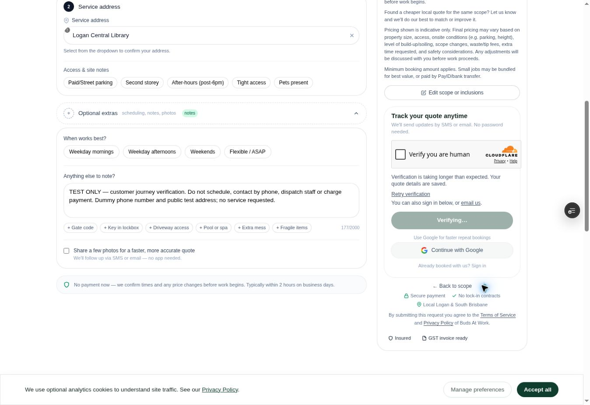
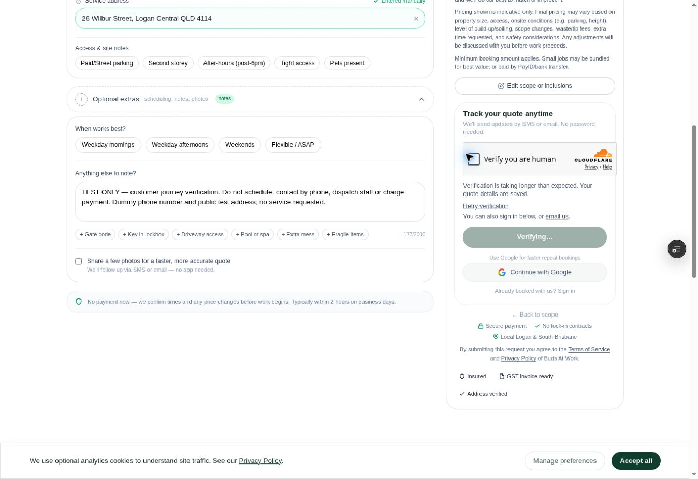

# Services to booking repair — 30 September 2026

## Customer behavior

The live production page (commit `1673be75a7097a3550b1417c75cc87b795ab3f74`) was inspected from Services through window selection and the contact step. Guest submission remained disabled on "Verifying…" with no recovery action. No live quote, email, payment or booking was created during this inspection.

The repair preserves a valid service selection and its draft through scope editing and authentication, fixes the full-window scope, and records readable quantities in quote notes. Signed-in customer state updates without reloading the page. Safe callback paths preserve the return journey. Guest verification now offers recovery for expired, failed, unsupported, timed-out and slow challenges. If the provider script fails to load, retry removes that failed script before remounting; server verification remains required.

Repeated clicks are blocked synchronously rather than aborting an earlier POST (which cannot undo its database insert). Submit shows a pending state, and a failed guest POST discards the possibly consumed verification token. Guest success displays the quote reference and explains that timing and the booking still await confirmation.

Post-submission lead linking, analytics and email work now use Next.js `after()` so Vercel keeps the response lifecycle alive while each task completes. Customer receipt, owner notification and NDIS forwarding use separate delivery idempotency keys. Provider-returned errors are logged; an NDIS quote is marked forwarded only after delivery is accepted. Sandbox submissions never send real email.

The payment receipt no longer treats a URL parameter as proof of payment. The server confirms payment status with Stripe; the client polls briefly for asynchronous completion, records conversion only after confirmation and offers retry/contact when confirmation cannot be established. An arbitrary or missing session/reference cannot display a successful payment.

## Booking semantics

Submission creates a `submitted` quote request, not a scheduled job. Existing approval → payment-page → Stripe session → order → payment-webhook behavior is retained. The customer must not be told that a service time is reserved merely because their quote has been received. No prices, payment methods or scheduling policies were changed.

The quote-claim permission migration already applied remotely is included in source history; do not reapply it blindly. No additional Supabase schema changes or production customer-data edits were made in this repair.

## Verification

- Focused suite: 75 tests passed across submission, checkout, webhook, payment receipt, auth, drafts, verification and scope regressions.
- TypeScript passed before the final provider-script recovery edit; the production compilation checks the final sources again.
- An outdated checkout URL expectation now asserts the existing customer `/pay/{quoteId}` URL, plus its returned Stripe session and order references.
- The normal local build was blocked by automatic approval review over possible Sentry build-data export. Local verification was rerun with build telemetry and source-map uploads explicitly disabled. Production Sentry runtime monitoring was not altered. Preview builds disable build telemetry/source-map export; production keeps its existing source-map setting.
- The local compilation succeeded, then exposed two existing private dashboard pages attempting database reads during static generation without server credentials. Those two pages are now explicitly dynamic so they read operational data at request time. No production credentials were downloaded into this checkout.

## Release gate

Automated tests and compilation do not prove delivery of a real email, payment capture, or live scheduling. The final end-to-end check must use a clearly labelled test request and an authorized test account. Any CAPTCHA interaction or form submission accepting site terms needs action-time confirmation under the browser's confirmation policy. Payment execution requires the user's handoff; do not charge a card to prove this repair.

## 1 October follow-up

The owner authorized the stable preview hostname in Cloudflare. The browser now displays an interactive human-verification checkbox. The check has not been clicked and no request has been submitted.

Preview address lookup also exposed a provider-disabled input. Step 3 now offers manual Queensland street/suburb/postcode entry independent of Google Places, labels manual addresses accurately and preserves edits when clearing the previous confirmation. Existing NDIS region detection/manual-region handling is retained.

The focused suite now passes 78 tests across 13 files. TypeScript and targeted ESLint pass for the additional address repair. The earlier local build completed all 217 static pages with two workers and no build uploads. The additional address repair awaits its Vercel build and browser verification.

## Human check result

Preview commit `b6da06ae96a54fb344ab407f783e445c07e7e77a` built successfully. Browser verification confirmed that manual Queensland address entry works and the draft survives a reload. The summary assurance text is now “Address provided” rather than claiming independent verification of a manual address.

The owner approved the CAPTCHA attempt. Cloudflare rejected the checkbox with client error `600010`; a single reload/recovery attempt was also rejected. Automated attempts stopped. The labelled request remains unsubmitted, with no emails, payment or scheduling created. A same-browser manual handoff is required for the owner to try verification directly; site terms still require approval before the final submission.

